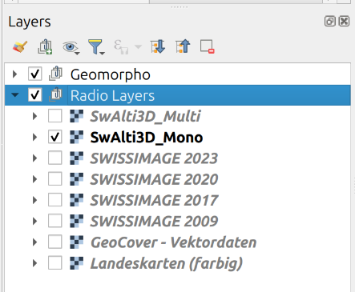
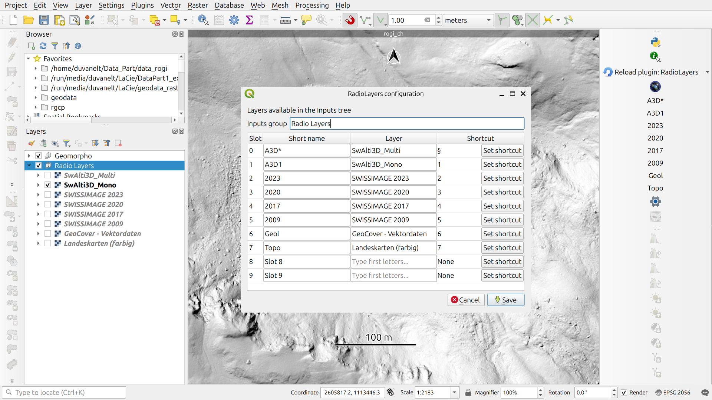

# RadioLayers Plugin
This plugin was originally developed by the High Mountain Geomorphology research group at the University of Lausanne. Investigating the geomorphological history of a landscape often requires switching between a large number of layers, such as digital elevation models, aerial imagery, topographic maps, and geological maps.

This plugin lets you display a selection of layers in a QGIS project as radio channels. You can assign keyboard shortcuts to layers; pressing a shortcut immediately hides all other layers in the group and displays the selected layer. This makes it more efficient to interpret spatial data from a wide variety of sources.

# How to Use

## Requirements
- This plugins works for Qgis 3, not for Qgis 4.

## 0) Installation
- Download the plugin as a ZIP archive from the repository. (Code > Download ZIP)
- In QGIS, go to **Plugins > Manage and Install Plugins > Install from ZIP**.
- Select the `RadioLayers.zip` file.
- A gray gear icon should appear in the plugin toolbar.

## 1) Prepare Your Project
### Select the radio layers
- Create a layer group and give it a name, such as "Radio Layers".
- Move the layers you want to display into the group. Keep in mind that only one layer at a time will be displayed within this group.

## 2) Configure the Plugin for Your Project
### Set up the configuration table
- Open the configuration dashboard by clicking the gray gear on the plugin toolbar.
- Type the first few letters of the layer group you created, such as "Radio Layers", and select it in the "Input group" box.
- For each slot, define a short name, choose a layer by typing its first few letters, and select it. You can then assign a keyboard shortcut to the layer (optional). If no shortcut is assigned, you can click the corresponding button on the plugin toolbar.
- Save the configuration.
- You are ready to go!

## 3) Save multiple configuration states
- Open the configuration dashboard and click **Save config** to save the current setup as a named CSV file. Choose a different filename for each setup you want to keep.
- Each file stores the input group and the ten slots' short names, layer names, and keyboard shortcuts.
- To switch setups, click **Load config** and choose a previously saved CSV. The dashboard and toolbar buttons update immediately.
- The dashboard's **Save** button writes changes to the currently selected configuration file. Before any file is loaded or saved under a new name, this is the plugin's default `user_links.csv` configuration.
- The selected file is not linked to a QGIS project. Load the desired CSV when switching projects; after the plugin is reloaded, it starts empty again.
